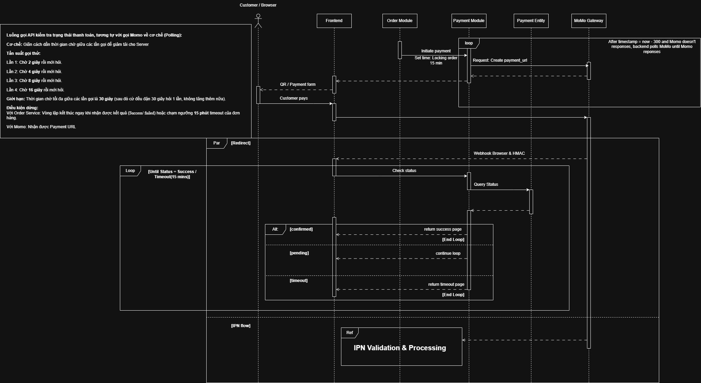
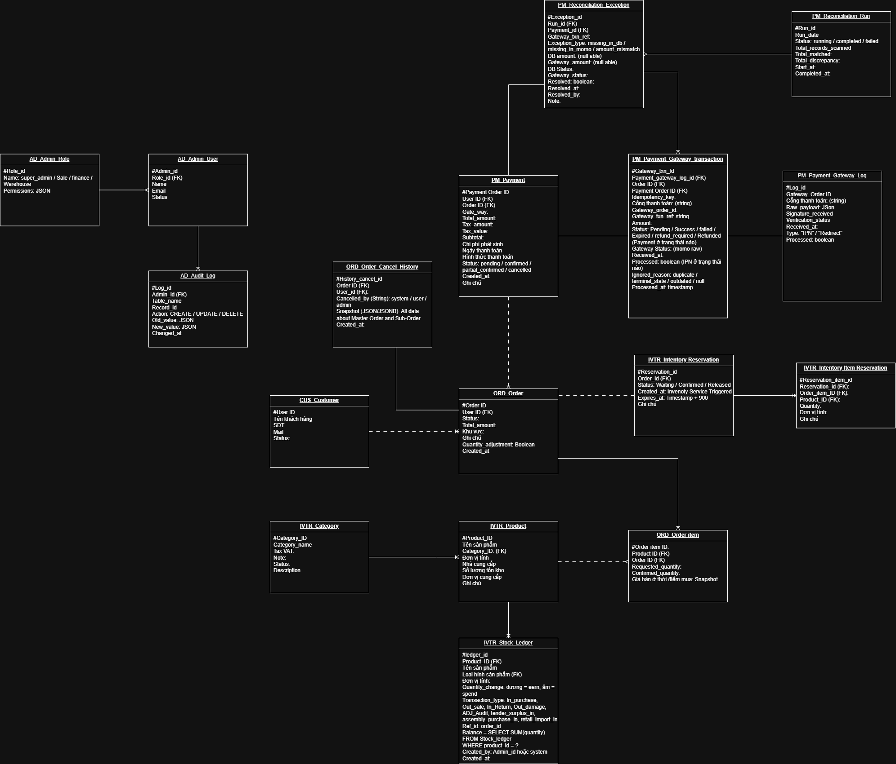
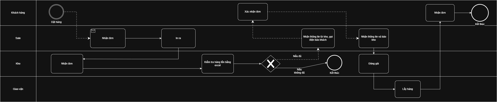

# Order Management System — Company X

**What this is:** A BA portfolio project documenting the requirements and system design for an OMS built for a company with an unusual inventory problem. Not a codebase. Not a finished product. A record of how the thinking was built — including the parts that were wrong the first time.

---

## The Problem

Company X bids on large equipment contracts for power plant construction. To complete a contract, they buy components in bundles. They use what they need. The rest sits in a warehouse.

Over time, three types of leftover inventory accumulated:

- Equipment left over from completed bids — usable, but doesn't sell as a standalone unit
- Components they buy externally to complete a leftover unit into something sellable
- Stock purchased directly to sell retail

None of this was being moved efficiently. Orders came in by phone and email. Inventory was tracked in Excel. Accounting reconciled everything by hand at month-end. No one outside the warehouse knew what stock existed or in what state.

Management decided to build a retail sales channel — online, automated, running in parallel with the bidding business without disrupting it.

---

## Why This Isn't Just "Build an E-Commerce Site"

The first version of this project did exactly that — jumped straight to a fully automated multi-vendor platform with vouchers, loyalty tiers, and microservices. A senior BA review stopped that.

The actual problem wasn't "we need software." It was "we have a manual process with no documentation, inconsistent data, and staff who have never worked with a formal system." Software built on top of that breaks immediately.

So the project was restructured into phases:

| Phase | What actually happens | Output |
|---|---|---|
| **G1–G2** | Standardize the process on paper first. Define SOPs. Clean and structure the data. Train staff on the new workflow — before any software exists. Accounting owns the data entry. | SOP document, clean dataset |
| **Buffer** | Wait until the business hits a volume threshold that justifies the investment. The Director decides when. | Business decision |
| **G3** | Build the OMS MVP. Scope is deliberately small. | **This repo's main scope** |
| **G4** | Vouchers, loyalty tiers, multi-seller, automated bank reconciliation. When the retail channel is mature enough to need them. | Future state — sketched, not designed |

G3 is a **monolith**. Not because microservices are wrong, but because a small team at an early stage doesn't need the operational complexity. That was also a correction — an earlier version of this project modeled a monolith database while drawing microservice-style sequence diagrams. The two don't go together.

---

## What G3 Actually Does

Five modules, one database, internal function calls between modules.

```
ORD   Order Management    Customer places order → system checks stock → 
                          creates order → initiates payment
                          
PM    Payment             MoMo integration + manual bank transfer confirmation
                          + daily automated reconciliation
                          
IVTR  Inventory           Ledger-based stock tracking (append-only, 3 stock sources)
                          + reservation system
                          
CUS   Customer            Registration, login, order history, notifications

ADM   Admin               Order management, stock management, reports, role-based access
```

---

## The Payment Flow — End to End

This is the part that has the most moving pieces, so it's worth walking through before looking at diagrams.

**Happy path:**

```
1. Customer places order
2. System checks stock (SELECT FOR UPDATE to prevent race condition)
3. Stock reserved — not deducted yet
4. Payment request sent to MoMo → customer gets payment URL
5. Customer pays on MoMo
6. MoMo sends IPN (server-to-server notification) to backend
7. Backend validates IPN signature (HMAC)
8. Backend checks: have we processed this IPN before? (idempotency)
9. Backend checks: is payment already in a terminal state?
10. Backend updates payment status → confirmed
11. Stock reservation confirmed → deducted from ledger
12. Customer notified → order confirmed
13. Return HTTP 200 to MoMo
```

**What can go wrong, and how it's handled:**

```
IPN never arrives (network failure)
→ backend polls MoMo after 5 minutes
→ frontend polls order status every 3 seconds, timeout at 15 min
```


```
Customer closes browser before redirect fires
→ IPN arrives anyway via server-to-server
→ IPN is source of truth, not the redirect

MoMo sends the same IPN multiple times
→ gateway_txn_ref checked against log before processing
→ duplicate detected → return 200, stop

IPN arrives out of order (failed IPN arrives after success IPN)
→ timestamp comparison: if IPN is older than last update, discard
→ terminal state protection: confirmed status cannot be overwritten
```

```
Payment confirmed in DB but MoMo has no record
→ caught by daily reconciliation job
→ flagged as exception → accounting reviews manually
```

```
---

## The Inventory Problem

Three sources of stock, all going into the same warehouse, all needing to be tracked differently:

- Bid leftovers (transferred in)
- External purchases to complete a unit (purchased to supplement)
- Direct retail purchases (purchased to sell)

A simple stock counter doesn't capture this. The solution is a ledger — every movement is a new row (sale, adjustment, transfer in, purchase in). The balance is always a `SUM()`. You can always trace why stock changed.

Reservation sits on top of this: when an order is created, stock is reserved (locked) but not deducted. It's only deducted when payment confirms. If payment fails or times out at 15 minutes, the reservation releases automatically.



---

## The Process Before Software

This is what the workflow looked like before any of this existed. It's included because understanding what was broken is the actual starting point of the BA work — not the solution.



The problems weren't hard to find: orders came in by phone and email with no central record, inventory was checked by eye or Excel with no audit trail, communication between Sales and Warehouse happened by phone, and the whole process depended on a small number of people who carried institutional knowledge that didn't exist anywhere else.

---

## What's in This Repo

```
/docs
  BRD_Phase3.docx              Business Requirements — written for the GĐ (Director)
  SRS_Phase3.docx              Software Requirements — written for Dev/QA
  BA_Document_v1.docx          As-Is / Gap / To-Be analysis (original scope)

/diagrams
  /bpmn
    BPMN_Transittion_phase_2.png                               Process standardization workflow
    BPMN_Transittion_phase_3.png                               Build approval workflow (BRD → SRS → Dev → UAT)
    BPMN_Work_flow_phase_2.png                                 Phase 2 operational workflow
    BPMN_Work_flow_phase_3.png                                 Phase 3 operational workflow
    BPMN_AS_IS_Phase_1.png                                     Original manual process
  /sequence
    Sequence-Order_Processing_phase_3.png                      Checkout →  Order creation
    Sequence-IPN_Validation_&_Processing_Phase_3&4.png         IPN signature validation & Duplicate/outdated/terminal-state detection
    Sequence-Payment_Phase_3&4.png                             Payment state update, request + polling
    Sequence-Trigger_Downstream_phase_3.png                    Success/failure downstream effects
    Sequence-Reconciliation.png                                Daily gateway reconciliation batch job
    Sequence-Cart_to_Master_Order_phase_4.png                  Checkout →  Master Order creation
    Sequence-Trigger_Downstream_Phase_4.png                    Success/failure downstream effects phase 4 with (voucher, loyalty, multi-vendor)
  /er            
    erd_phase4.png        Extended model (voucher, loyalty, multi-vendor) — G4 reference
    erd-phase3.png             Scoped-down model actually used for G3

/sql
  01-05_*.sql             SQL scripts from the DA project below

/dashboard
  powerbi_screenshot.png
```

---

## Iterations

Two major revision cycles after senior BA review — scope corrections (B2B/B2C separation), architecture alignment (monolith consistency throughout), transition phase gaps, and a reconciliation query logic fix. The current BRD, SRS, and ERD reflect those corrections.

---

## Related — Data Analytics Project

A separate project: analysis of 700,000+ job postings using CTEs, window functions, LAG, ROW_NUMBER, and self-joins in PostgreSQL, visualized in a 5-page Power BI dashboard. In `/sql` and `/dashboard`. Different project, same repo.

---

## Status

Portfolio project. Several business decisions in the SRS are flagged as open and left unresolved — guest checkout, tier validity calculation, voucher behavior on downgrade. These are the kind of questions a BA takes back to a stakeholder rather than deciding alone.

Feedback welcome.

